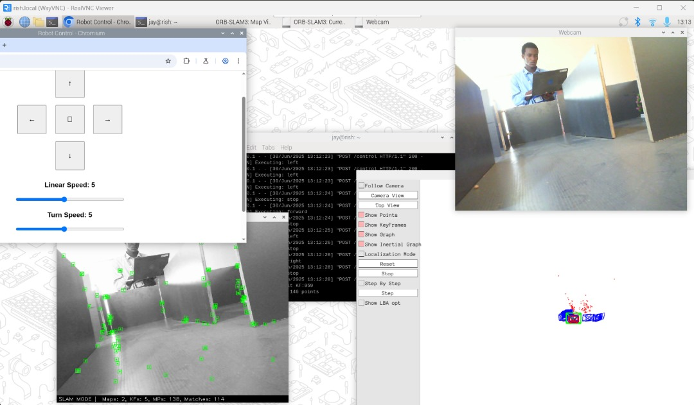
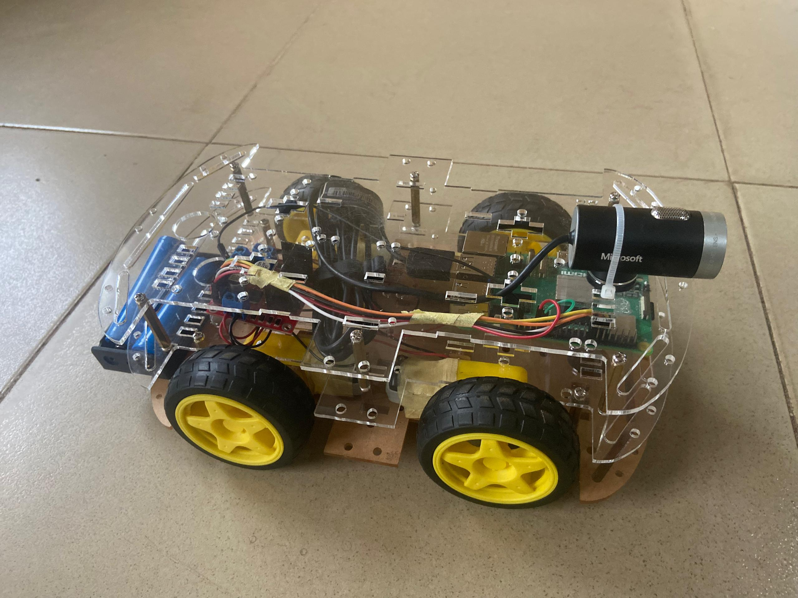
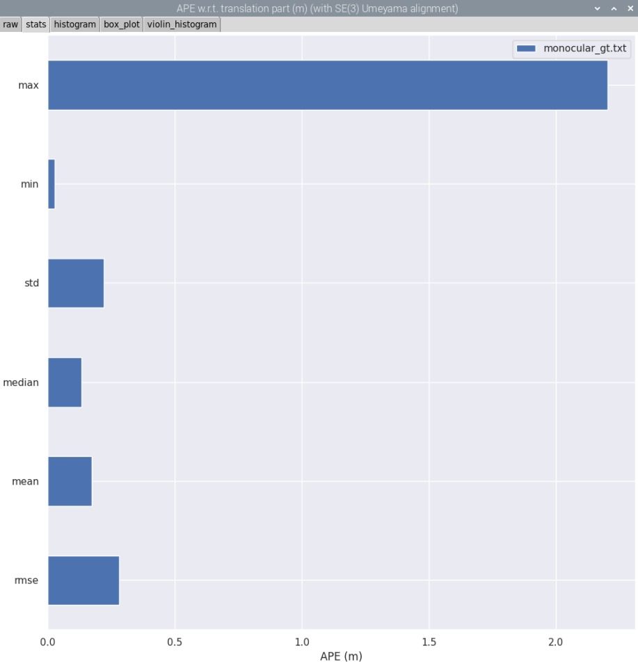
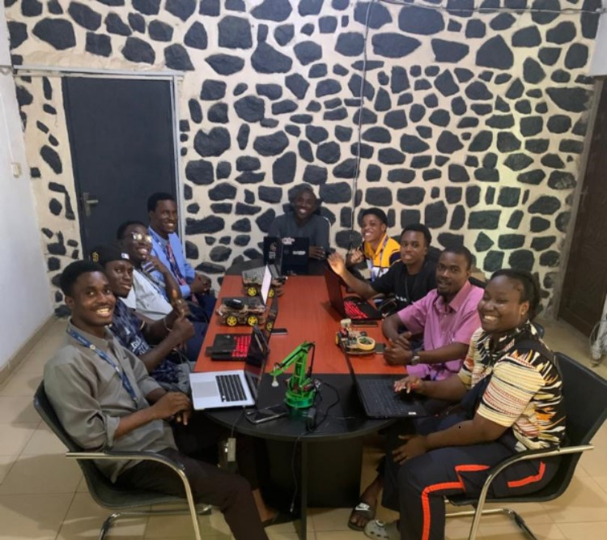

# Clinic-VSLAM-OCR-Pi5 (CVOP5)

### Visual SLAM with OCR Integration for Indoor Semantic Mapping on Raspberry Pi 5
### V1.0 July, 2025


This repository documents the implementation of a real-time **Visual SLAM (Simultaneous Localization and Mapping)** system enhanced with **Optical Character Recognition (OCR)** for semantic mapping in an indoor clinic environment. Built around the low-cost **Raspberry Pi 5** and powered by the **ORB-SLAM3** engine, the system can not only track its position in space using a monocular camera but also read and log text-based semantic cues such as *“WARD”*, *“PHARMACY”*, and *“CLINIC”*.

This work was carried out as the **Final Year Undergraduate Project** for the **B.Eng. in Mechatronics Engineering** program at **Bowen University**, Iwo, Nigeria, submitted in **July 2025**. The core contribution lies in demonstrating how **low-power embedded systems** can be adapted to perform meaningful **semantic localization** by combining classical SLAM with lightweight OCR techniques in a constrained environment.

The system's pipeline is capable of operating offline and provides timestamped logs for evaluation using standard trajectory metrics.

## 1. Overview


*Figure 1: System overview – combining SLAM, OCR, and semantic labeling on Raspberry Pi 5.*

* **Platform**: Raspberry Pi 5
* **SLAM Engine**: [ORB-SLAM3](https://github.com/UZ-SLAMLab/ORB_SLAM3)
* **Camera**: Microsoft Lifecam Studio 1080p HD Webcam
* **OCR**: [EasyOCR](https://github.com/JaidedAI/EasyOCR)
* **Control Interface**: Flask-based web server
* **Semantic Logging**: Labels + 4x4 camera poses
* **Evaluation**: Performed using `evo_traj`, `evo_ape`, and trajectory overlays


*Figure 2: Assembled Robot (Grace).*

## 2. Project Structure

```bash
dev/
├── ORB_SLAM3/               # Forked and patched ORB-SLAM3 (for Raspberry Pi)
│   ├── Vocabulary/          # Contains ORBvoc.txt (not uploaded)
│   ├── Examples/            # Includes created mono_webcam.cc
│   └── Logs/                # SLAM and OCR logs (auto-created)
├── Plots/                   # APE, Trajectory and Semantic plots
│   └── final/               # Cleaned versions for publication
├── code/                    # Utilities
├── vslam.sh                 # Bash script to launch SLAM, OCR, and Flask UI
├── flask_motor.py           # Motor control via web interface
├── ocr_monitor.py           # Asynchronous OCR reading from video pipe
└── README.md                # This file
```

> Only CMakeLists.txt and Examples/Monocular/\* are tracked to reduce repo size.

## 3. Features

* **Real-Time SLAM** using monocular input
* **Text detection and recognition** (OCR) from live video stream
* **Semantic pose logging** for room classification
* **Post-run 3D plotting** of trajectories and labels
* **Offline evaluation** using APE and synthetic timestamps
* **Flask interface** for robot control via keyboard or web

## 4. Usage

### Runtime Execution

```bash
# Mapping mode
./vslam.sh map

# Localization mode (requires existing map)
./vslam.sh localize
```

* Launches:

  * `ORB_SLAM3` (real-time SLAM)
  * `ocr_monitor.py` (reads from video stream pipe)
  * `flask_motor.py` (local keyboard/web control)
* All processes are started in **parallel using tmux panes**.

> OCR is not directly synchronized with SLAM keyframes. Semantic logs are matched with pose logs using timestamps after the run.

## 5. Dependencies

### Raspberry Pi Setup

* Raspberry Pi OS 64-bit (bookworm)
* Python 3.11+ and virtual environment
* `tmux`, `v4l-utils`, `opencv-python`, `easyocr`, `flask`, `evo` (`evo_traj`, `evo_ape`)

### Install Dependencies

```bash
sudo apt install tmux v4l-utils python3-opencv
pip install -r requirements.txt
```

Your `requirements.txt` may look like:

```text
opencv-python
flask
easyocr
evo
matplotlib
```

## 6. Evaluation & Results


*Figure 3: APE trajectory comparison between ground truth and SLAM-estimated path.*


*Figure 4: APE Metrics*

* **Trajectory Evaluation** using `evo_traj` and `evo_ape` `(see plot_traj.sh)`
* **APE Metrics** from synthetic timestamp matching `(see code/matcher.py)`:

  * **RMSE**: 0.282 m
  * **Mean**: 0.174 m
  * **Max**: 2.20 m
* **3D Trajectory plots** with semantic overlays
* Evaluation logs and plots saved in `Plots/`

## 7. Datasets and Maps

* Maps saved as `.bag` files using ORB-SLAM3's `SaveAtlasToFile` option
* OCR logs and semantic pose logs stored under `ORB_SLAM3/Logs/`

## 8. Limitations

* OCR runs as an independent process (not tightly coupled with SLAM keyframes)
* Some OCR labels may have temporal offset or missing poses
* Loop closure optimization was not enabled due to processing limits
* Results limited to indoor clinic model (5 rooms, 8x8 ft wooden structure)

## 9. Research Impact

This project explores the fusion of low-cost SLAM and OCR to add **semantic context** to maps. It may serve as a base for:

* Semantic-aware navigation in assistive robots
* Indoor localization with text cues (e.g., hospital signage)
* SLAM dataset augmentation with ground truth labels

## 10. Acknowledgements

This project was developed by a team of three 500 Level Mechatronics Engineering students from **Bowen University**, under the supervision of:

> **Dr. Segun Adebayo** </br>
> Department of Mechatronics Engineering </br>
> Bowen University, Iwo, Osun State, Nigeria

### Contributors:

* **Joseph Fatoye** - Project lead 
* **Laide-Muibi Ayomiposi**
* **Bassey Joshua**

We are deeply grateful to our supervisor, mentors, and the Bowen University Mechatronics department for their support and academic resources. Special thanks to the open-source community—particularly **UZ-SLAMLab**, **JaidedAI**, and contributors to **OpenCV**, **Flask**, and the **evo** toolkit—for enabling this project.



## 12. License

This project is for academic and research purposes. Individual libraries (ORB-SLAM3, EasyOCR, etc.) retain their original licenses. See each repo for details.

## 13. Contributions

You're welcome to fork, suggest improvements, or raise issues. Feel free to cite this repository or adapt it to your own research needs.
